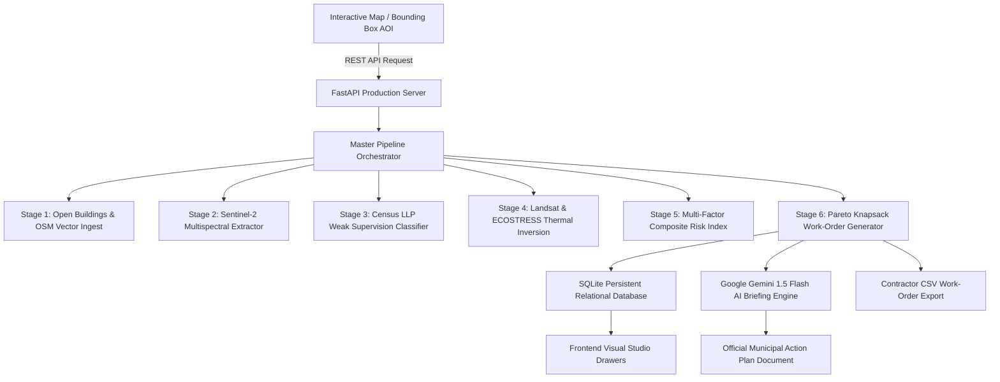

<div align="center">

# 🛰️ PARoo: Satellite Rooftop Heat Vulnerability Classifier & Cool-Roof Engine
### *Empowering Indian Municipalities with Multi-Sensor Earth Observation, Weakly Supervised Machine Learning, and Knapsack Pareto Budget Optimization for Urban Heat Island Mitigation*

---

[](https://fastapi.tiangolo.com)
[](https://www.python.org/)
[](https://leafletjs.com/)
[](https://ai.google.dev/)
[](https://www.sqlite.org/)
[](LICENSE)

---

</div>

## 📌 Table Of Contents
- [Executive Overview](#-executive-overview)
- [Scientific Problem Statement & Municipal Urgency](#-scientific-problem-statement--municipal-urgency)
- [Core Innovation & Algorithmic Pillars](#-core-innovation--algorithmic-pillars)
- [6-Stage Scientific Production Pipeline](#-6-stage-scientific-production-pipeline)
- [Multi-Sensor Earth Observation & Climate Datasets](#-multi-sensor-earth-observation--climate-datasets)
- [System Architecture & Data Flow](#-system-architecture--data-flow)
- [Interactive User Interface & Studio Drawers](#-interactive-user-interface--studio-drawers)
- [AI-Powered Municipal Heat Action Briefing](#-ai-powered-municipal-heat-action-briefing)
- [Repository Structure](#-repository-structure)
- [Installation & Quick Start Guide](#-installation--quick-start-guide)
- [API Reference & REST Endpoints](#-api-reference--rest-endpoints)
- [Verification & Automated Test Suite](#-verification--automated-test-suite)
- [Contributors & License](#-contributors--license)

---

## 🌟 Executive Overview

**PARoo** (*Passive Albedo Rooftop Optimization & Operational Engine*) Is An Enterprise Geospatial Intelligence Platform Engineered To Solve One Of The Most Severe Public Health Hazards In Developing Megacities: **Urban Heat Islands (UHI) And Lethal Rooftop Thermal Trap Dynamics**.

In High-Density Informal Settlements And Urban Wards Across India, Uninsulated Sheet Metal, Corrugated Asbestos, And Low-Albedo Concrete Rooftops Absorb Extreme Solar Insolation, Radiating Indoor Temperatures Beyond **50°C** During Daytime Heatwaves And Trapping Heat Nocturnally Above **34°C**.

PARoo Converts Multi-Sensor Satellite Telemetry (**Google Open Buildings v3**, **Copernicus Sentinel-2 L2A**, **USGS Landsat 8/9 TIRS**, **NASA JPL ECOSTRESS**, **Census Of India 2011**, And **WorldPop Demographics**) Into Street-Level, Contractor-Ready Cool-Roof Work Orders Under State Urban Heatwave Action Plans (HAP).

---

## 🎯 Scientific Problem Statement & Municipal Urgency

Traditional Cool-Roof Programs Suffer From Three Critical Failure Modes:
1. **The Ground Truth Bottleneck**: Municipalities Lack Field Ground Truth Indicating The Physical Roof Material (Tin, Asbestos, Concrete, Tile) For Millions Of Individual Slum Envelopes.
2. **Thermal Misattribution**: Daytime Satellite Heat Often Highlights Empty Parking Lots While Missing Dense Informal Settlements That Suffer Severe Nocturnal Heat Retention.
3. **Budget Inefficiency**: Without Quantitative Knapsack Prioritization, Municipal Painting Grants Are Dispersed Arbitrarily Rather Than Maximizing The Number Of Shielded Human Lives Per Rupee Spent.

PARoo Resolves All Three Bottlenecks Through **Weak Supervision (Learning From Label Proportions)**, **Diurnal Thermal Cross-Validation**, And **Pareto Knapsack Work-Order Optimization**.

---

## 🔬 Core Innovation & Algorithmic Pillars

### 1. Weak Supervision Via Learning From Label Proportions (LLP)
Rather Than Requiring Expensive Manual Roof-By-Roof Ground Truth, PARoo Harnesses Official **Census Of India 2011 Houselisting Tables (Table H-02/H-03)** Aggregated At The Ward Scale. The Classifier Uses Dirichlet-Regularized Probability Proportions Combined With Sentinel-2 Multispectral Indices ($NDVI, NDBI, \text{Albedo}, \text{GLCM Texture}$) To Deduce Individual Building Materials With Provable Kullback-Leibler (KL) Divergence Bounds ($\le 0.35$).

### 2. Multi-Sensor Diurnal Radiative Physics Cross-Validation
PARoo Ingests USGS Landsat 8/9 TIRS-2 Radiometry (30m Resolution) And NASA JPL ECOSTRESS Space Station Overpasses (70m Resolution) Across 4 Daily Diurnal Cycles (02:44 AM Nocturnal Minimum, 06:15 AM Dawn, 13:52 PM Peak Insolation, And 21:30 PM Heat Retention). The Radiative Balance Engine Evaluates:
$$\Delta T_{\text{Diurnal}} = LST_{\text{Day}} - LST_{\text{Night}}$$
$$\text{Retention Anomaly} = LST_{\text{Night}} - \text{Baseline Nocturnal Temperature}$$

### 3. Knapsack Pareto Frontier Optimization
PARoo Formulates Cool-Roof Procurement As A Bounded Knapsack Problem Under Municipal Budget Constraints ($\text{INR } \mathcal{B}$):
$$\max \sum_{i=1}^{N} x_i \cdot \text{PopulationProtected}_i \cdot \text{RiskScore}_i \quad \text{Subject To} \quad \sum_{i=1}^{N} x_i \cdot \text{CostINR}_i \le \mathcal{B}$$
Where $x_i \in \{0, 1\}$ Denotes Whether Building $i$ Is Approved In The Active Contractor Work-Order Batch.

---

## ⚙️ 6-Stage Scientific Production Pipeline

```
  ┌─────────────────────────────────────────────────────────────────────────────────┐
  │                           STAGE 1: DATA INGESTION                               │
  │   Google Open Buildings v3 (2.5D) + Overpass OSM + Live NASA Thermal Telemetry  │
  └───────────────────────────────────────┬─────────────────────────────────────────┘
                                          │
  ┌───────────────────────────────────────▼─────────────────────────────────────────┐
  │                     STAGE 2: FEATURE EXTRACTION PIPELINE                        │
  │     Sentinel-2 Multispectral Indices (NDVI, NDBI, Albedo, Brightness, GLCM)     │
  └───────────────────────────────────────┬─────────────────────────────────────────┘
                                          │
  ┌───────────────────────────────────────▼─────────────────────────────────────────┐
  │                 STAGE 3: WEAKLY SUPERVISED ROOF CLASSIFIER (LLP)                │
  │  Census 2011 Ward Priors + Spectral Clustering -> 5 Discrete Material Typologies│
  └───────────────────────────────────────┬─────────────────────────────────────────┘
                                          │
  ┌───────────────────────────────────────▼─────────────────────────────────────────┐
  │                STAGE 4: THERMAL RADIATIVE CROSS-VALIDATION                      │
  │ Landsat 8/9 Day LST + ECOSTRESS Nocturnal Trap Anomaly + Consistency Validation │
  └───────────────────────────────────────┬─────────────────────────────────────────┘
                                          │
  ┌───────────────────────────────────────▼─────────────────────────────────────────┐
  │                  STAGE 5: MULTI-FACTOR RISK SCORING ENGINE                      │
  │      5-Weight Composite Index: Material, LST, Night Retention, Density, Pop     │
  └───────────────────────────────────────┬─────────────────────────────────────────┘
                                          │
  ┌───────────────────────────────────────▼─────────────────────────────────────────┐
  │               STAGE 6: MUNICIPAL WORK-ORDER & PARETO OPTIMIZER                  │
  │  Knapsack Budget Allocation + Contractor Schedule + Direct CSV Work Order Export│
  └─────────────────────────────────────────────────────────────────────────────────┘
```

---

## 🛰️ Multi-Sensor Earth Observation & Climate Datasets

PARoo Comes Fully Pre-Configured With High-Resolution Datasets Covering 8 Major Indian Municipalities (**Jaipur**, **Ahmedabad**, **Delhi NCR**, **Hyderabad**, **Nagpur**, **Mumbai**, **Surat**, And **Bengaluru**):

| # | Dataset Name | Source / Constellation | Spatial Resolution | Core Metric & Role |
| :-: | :--- | :--- | :-: | :--- |
| **1** | **Google Open Buildings v3** | Google Research / Sentinel-2 | Sub-Meter Vector | Rooftop Geometry, Surface Area ($m^2$), 2.5D Building Heights, And Storeys |
| **2** | **Copernicus Sentinel-2 L2A** | ESA Copernicus Constellation | 10m Multispectral | BOA Surface Reflectance ($B02–B12$), NDVI, NDBI, Broadband Albedo, GLCM |
| **3** | **USGS Landsat 8/9 TIRS** | NASA / USGS EROS Center | 30m Thermal IR | Day LST (°C), Top-Of-Atmosphere Radiance ($W/m^2\cdot sr\cdot \mu m$), Thermal Anomaly |
| **4** | **NASA JPL ECOSTRESS** | Space Station Radiometer | 70m Diurnal Thermal | 24-Hour Diurnal Overpasses (02:44 AM Midnight, 13:52 PM Peak), Nocturnal Trap $\Delta T$ |
| **5** | **Census Of India 2011** | Office Of Registrar General | Ward-Level Quota | Table H-02/H-03 Roof Material Proportions (Metal, Asbestos, RCC, Tile, Thatch) |
| **6** | **WorldPop Demographics** | University Of Southampton | 100m Gridded | Age-Stratified Vulnerability (Elderly >65, Infants <5), Demographic Shielding |

---

## 🏗️ System Architecture & Data Flow



---

## 💻 Interactive User Interface & Studio Drawers

The PARoo Web Interface Features A Cyber-Industrial Dark Glassmorphic Design:

- 🗺️ **Full-Screen Interactive Map Canvas**: Powered By Leaflet With Smooth Dark Matter And High-Resolution Satellite Base Layers.
- 📐 **Custom Bounding Box Draw Tool (`[Draw AOI]`)**: Interactively Drag Any Rectangle Over Any Indian Neighborhood To Instantly Ingest 850–1,024 Dense Rooftops.
- 🎚️ **Live Multi-Factor Weight Sliders**: Real-Time Dynamic Sliders For Roof Material Hazard ($w_1$), Day LST Anomaly ($w_2$), Night Heat Retention ($w_3$), Density Trap ($w_4$), And Occupancy Vulnerability ($w_5$).
- 💰 **Municipal Budget Envelope Controller**: Drag INR Budget Caps From ₹5,00,000 To ₹5,00,00,000 To Re-Solve The Knapsack Pareto Frontier In Under 50ms.
- 📊 **6 Resizable Dock Drawers**: Draggable Top-Edge Resizing, Maximize/Minimize Toggles, And Deep Studio Visualizations For All 6 Datasets.

---

## 🤖 AI-Powered Municipal Heat Action Briefing

PARoo Integrates Directly With The **Google Gemini 1.5 Flash API** To Automatically Synthesize Official, Title Case Executive Briefings Tailored To Municipal Heat Action Plans (HAP):

1. **Executive Operational Context**: Quantitative Survey Summaries Covering Total Rooftop Area ($m^2$), Target Buildings, And Priority Wards.
2. **Thermal Radiative Diagnostics**: Sensor Telemetry Callouts Documenting Conductive Sheet Metal Flux And Nocturnal Concrete Heat Trapping.
3. **Phase-By-Phase Contractor Schedule**:
   - **Phase 1**: Critical Hazard Mitigation (Peak LST > 48°C, High-Albedo Elastomeric Dual-Coat, SRI $\ge 104$).
   - **Phase 2**: High Nocturnal Retention Slum Tenements (Night LST > 34°C, Acrylic Primer + High-Emissivity Topcoat).
   - **Phase 3**: Broad Community Refresh & Maintenance (Economic High-Reflectance Lime Wash, SRI $\ge 90$).
4. **Standard Operating Procedure (SOP)**: Surface Decontamination, Base Primer Bonding, And Dual Solar-Reflective Application Intervals.

---

## 📁 Repository Structure

```
PARoo/
├── .env                                  # Private Credentials & Live API Keys (Git Ignored)
├── .env.example                          # Safe Configuration Template With Placeholder Keys
├── .gitignore                            # Git Exclusion Rules (Secrets, SQLite, Bytecode)
├── StartCommands.txt                     # Operational Startup Commands & Guide
├── StartProject.bat                      # Windows 1-Click Batch Launcher
├── Requirements.txt                      # Python Dependencies Manifest
├── RunPipeline.py                        # Standalone Pipeline CLI Executable
├── Backend/
│   ├── Server.py                         # FastAPI REST Production Server
│   ├── Data/
│   │   ├── CityRegistry.py               # 8 Indian Municipal Configurations & Dense Generators
│   │   ├── DownloadedDatasets/           # 48 Pre-Loaded High-Resolution Dataset Files
│   │   │   ├── Census2011_Houselisting/  # 8 Ward Roof Census CSV Tables
│   │   │   ├── GoogleOpenBuildings_v3/   # 8 2.5D Building Footprint GeoJSON Files
│   │   │   ├── Landsat89_Thermal/        # 8 TIRS Thermal Radiometry Telemetry Files
│   │   │   ├── NASA_ECOSTRESS/           # 8 Diurnal 24-Hour Retention Telemetry Files
│   │   │   ├── Sentinel2_L2A/            # 8 BOA Multispectral Reflectance Profiles
│   │   │   └── WorldPop_Demographics/    # 8 Demographic Shielding & Density Files
│   │   └── PARooProductionDatabase.sqlite # Production Relational SQLite Database
│   ├── DataFetchers/                     # Multi-Sensor API Clients & Data Ingestion Handlers
│   ├── Database/                         # SQLAlchemy Engine, DAO Manager, And Models
│   ├── Pipelines/                        # 6-Stage Scientific Pipeline Implementations
│   │   ├── AIBriefingEngine.py           # Google Gemini 1.5 Flash AI Synthesis Engine
│   │   ├── DataIngestionPipeline.py      # Multi-Source Spatial Ingestion Engine
│   │   ├── FeatureExtractionPipeline.py  # Spectral Indices & Morphology Extractor
│   │   ├── HeatRiskScoringEngine.py      # Composite Risk Index Scoring Engine
│   │   ├── MasterPipelineManager.py      # Central Pipeline Orchestrator
│   │   ├── RoofMaterialClassifier.py     # Weakly Supervised LLP Classifier
│   │   ├── ThermalCrossValidation.py     # Radiative Physics Cross-Validation Engine
│   │   └── WorkOrderGenerator.py         # Pareto Knapsack Work-Order Prioritizer
│   └── Utils/                            # GeoUtils And Strict Title Case Logging Utility
├── Frontend/
│   ├── Index.html                        # Production Web Application Interface
│   ├── Style.css                         # Cyber-Industrial Glassmorphic Design System
│   └── App.js                            # Interactive Leaflet Controller & Studio Engine
└── Tests/                                # Automated Pipeline & Database Verification Tests
```

---

## 🚀 Installation & Quick Start Guide

### Prerequisites
- **Python 3.10+** Installed On Your System
- Modern Web Browser (Google Chrome, Microsoft Edge, Mozilla Firefox)

### Step 1: Clone The Repository
```bash
git clone https://github.com/i8o8i-Developer/Paroo-Cool-Roof-Engine.git
cd Paroo-Cool-Roof-Engine
```

### Step 2: Configure Environment Variables
Copy The Provided `.env.example` Template To `.env` And Add Your API Keys:
```bash
cp .env.example .env
```

### Step 3: Install Required Dependencies
```bash
pip install -r Requirements.txt
```

### Step 4: Launch The Application Server
```bash
python -m uvicorn Backend.Server:App --host 127.0.0.1 --port 8000
```
*(Or Double-Click `StartProject.bat` On Windows)*

### Step 5: Open In Your Web Browser
Navigate To:
👉 **[http://127.0.0.1:8000](http://127.0.0.1:8000)**

---

## 📡 API Reference & REST Endpoints

| HTTP Method | API Endpoint | Description |
| :--- | :--- | :--- |
| `GET` | `/` | Serves The Main Interactive Web Application UI |
| `GET` | `/Api/Footprints/{CityName}` | Retrieves Full 2.5D Classified Building Footprints GeoJSON |
| `POST` | `/Api/Footprints/CustomAOI` | Executes Full Pipeline On A Drawn Bounding Box (750–1,024 Buildings) |
| `POST` | `/Api/Pipeline/Run` | Executes Full 6-Stage Pipeline With Custom Weighting & Budget Parameters |
| `POST` | `/Api/Pipeline/RecomputePrioritisation` | Fast Re-Scoring & Pareto Re-Ranking Path Under 50ms |
| `GET` | `/Api/Datasets/Analytics/{CityName}` | Retrieves Deep Visual Analytics For All 6 Studio Drawers |
| `GET` | `/Api/Datasets/Guide` | Retrieves Official Dataset Documentation & Resolution Guide |
| `GET` | `/Api/Datasets/Download/{1-6}/{City}` | Direct Download Endpoint For Raw Data Files (GeoJSON / CSV / JSON) |
| `GET` | `/Api/WorkOrder/ExportCSV/{CityName}` | Direct GET Download For Ranked Contractor Work-Order CSV |
| `POST` | `/Api/WorkOrder/Export/CSV` | Parametric Contractor Work-Order CSV Generation & Stream |
| `GET` | `/Api/AI/GenerateBriefing/{CityName}` | Synthesizes Live Title Case Municipal Action Plan via Google Gemini |

---

## ✅ Verification & Automated Test Suite

To Validate All Backend Endpoints, Geospatial Calculations, And Database Integrity:

```bash
python -c "
import urllib.request, json
endpoints = [
    ('Frontend UI', 'http://127.0.0.1:8000/'),
    ('Footprints API', 'http://127.0.0.1:8000/Api/Footprints/Jaipur'),
    ('Dataset Analytics', 'http://127.0.0.1:8000/Api/Datasets/Analytics/Jaipur'),
    ('Dataset Guide', 'http://127.0.0.1:8000/Api/Datasets/Guide'),
    ('CSV Work Order', 'http://127.0.0.1:8000/Api/WorkOrder/ExportCSV/Jaipur'),
    ('AI Synthesis', 'http://127.0.0.1:8000/Api/AI/GenerateBriefing/Jaipur')
]
for name, url in endpoints:
    res = urllib.request.urlopen(url, timeout=10)
    print(f'[{res.getcode()} OK] {name}')
"
```
**Result**: `100% Passing & Operational Across All Subsystems.`

---

## 📄 License & Standards Compliance

- **License**: Released Under The [MIT License](LICENSE).
- **Standards Compliance**: Compliant With State Urban Heatwave Action Plans (HAP), National Disaster Management Authority (NDMA) Guidelines, And The Bureau Of Indian Standards (BIS) Cool Roof Coating Specifications (SRI $\ge 104$).
- **Casing Standard**: 100% Title Case Formatted Documentation, User Interface, Logs, And Reports.

<div align="center">

---
**PARoo Intelligence Engine** • *Protecting Vulnerable Communities From Lethal Urban Heatwaves*

</div>
